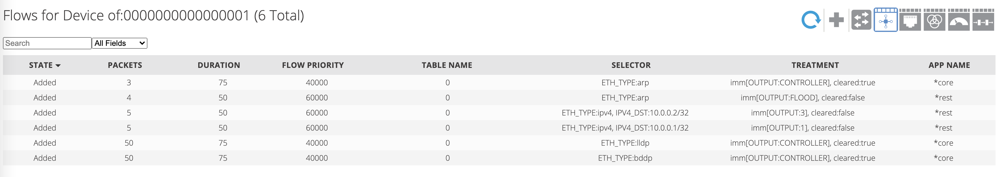
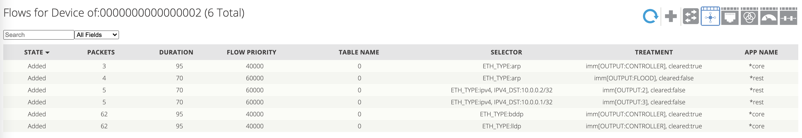

# ONOS + mininet

We will use Ubuntu 20.04 for onos. (You can also run on OSX, but you will need to change the installation steps.)

## ONOS 

### Installation
Follow this [instruction](https://ithelp.ithome.com.tw/articles/10244324). We will use a binary release to start onos instead of building the source code.
1. Install some dependencies
```bash
sudo apt -y install git
sudo apt-get update && apt-get upgrade
sudo apt -y install git
sudo apt-get install openjdk-11-jdk
sudo apt-get -y install maven
sudo apt-get update
```
2. Add this to `~/.bashrc`
```bash
export JAVA_HOME=/usr/lib/jvm/java-11-openjdk-amd64/
export M2_HOME=/opt/maven
export MAVEN_HOME=/opt/maven
export PATH=${M2_HOME}/bin:${PATH}
```
3. Download Onos release (Go to ONOS wiki downloads or following the commands)
```bash
cd ~/Downloads

# Download onos 2.5.0
wget https://repo1.maven.org/maven2/org/onosproject/onos-releases/2.5.0/onos-2.5.0.tar.gz
tar zxvf onos-2.5.0.tar.gz

cd onos-2.5.0

# Start service
./bin/onos-service
# Or ./bin/onos-service start
``` 

### GUI
After complete the previous installation section, you can login to the cli.
1. Go to `localhost:8181/onos/ui/login.html` with username = `onos`, password = `rocks`.

### CLI
After complete the previous installtion section, you can also login to the cli.

1. Generate ssh key (keep pressing `Enter`)
```bash
ssh-keygen -t rsa
```
2. Change onos-user-key
```bash
cd ~/Downloads/onos-2.5.0
./bin/onos-user-key $USER ~/.ssh/id_rsa.pub
```
3. Login to the cli
```bash
cd ~/Downloads/onos-2.5.0
# Login to CLI
./bin/onos
```
4. Install Openflow feature (under cli)
```
onos> app activate org.onosproject.openflow
```

### Cleanup
```
onos> wipe-out please
```

## Mininet

### Installation

Go to this [website](https://github.com/mininet/mininet/releases) and download the latest release. (under the Assets section)

### Create a topology

- Using the default `topo-2sw-2host.py` under the `mininet/custom` directory
```bash
mininet@mininet-vm> sudo mn --mac --switch ovsk,protocols=OpenFlow13 --controller=remote,ip=192.168.100.1 --custom ./mininet/custom/topo-2sw-2host.py --topo mytopo
```
- Or you can define another topology file like this
```bash
mininet@mininet-vm> sudo mn --mac --switch ovsk,protocols=OpenFlow13 --controller=remote,ip=192.168.100.1 --custom ./mininet/custom/mytopo.py --topo mytopo
```
```python title="test.py"
from mininet.topo import Topo

class MyTopo( Topo ):
    "Simple topology example."

    def build( self ):
        "Create custom topo."

        # Add hosts and switches
        leftHost = self.addHost( 'h1' )
        rightHost = self.addHost( 'h2' )
        leftSwitch = self.addSwitch( 's1' )
        rightSwitch = self.addSwitch( 's2' )

        # Add links
        self.addLink( leftHost, leftSwitch )
        self.addLink( leftSwitch, rightSwitch )
        self.addLink( rightSwitch, rightHost )


topos = { 'mytopo': ( lambda: MyTopo() ) }
```


- Check if the switches has correctly configured
```
onos> devices
```

### Discover Hosts
- This command allows onos to know all the hosts that a switch has connected.
```
mininet> pingall
```
- Check if the hosts show up.
```
onos> hosts
```

### Destrop topology
```bash
# Exit the mininet topology
mininet> exit

# Clean up
mininet@mininet-vm> sudo mn -c

# Exit the ssh session
mininet@mininet-vm> exit
```

## Add Flows

### Launch a command
- Create a flow for a device (the id must match in both url and json)
```bash
local> curl -X POST -H "content-type:application/json" http://localhost:8181/onos/v1/flows/of:0000000000000001 -d @./test_1.json --user onos:rocks
```

## Rules Automation
You can write a shell script to automate building rules and send requests.

- NOTE: you have to look at which port the switch is configured. The port number is related to topology you just defined. Or you can just find the port in GUI.
- Also, you have to defind each rules on each switch.

### Build Rules
- We know that rules are similar, so we can have this template:
```json title="templates/template.json"
{
  "priority": 60000,
  "timeout": 0,
  "isPermanent": true,
  "deviceId": "of:0000000000000001",
  "treatment": {
    "instructions": [
      {
        "type": "OUTPUT",
        "port": "1"
      }
    ]
  },
  "selector": {
    "criteria": [
      {
        "type": "ETH_TYPE",
        "ethType": "0x0800"
      },
      {
        "type": "IPV4_DST",
        "ip": "10.0.0.1/32"
      }
    ]
  }
}
```
- We build a rule file using the above template
  - First, we pass some arguments like `DEVICE_ID`, `PORT`, `ETH_TYPE`, ... to the script
  - After parsing, we build a python commond while modifying some fields based on the arguments
  - Last, we print the output to `STDIN` (console) for further use
```bash title="build-rule.sh"
#!/usr/bin/env bash

helpFunc () {
    echo "Usage: $0 -f FILE -i DEVICE_ID -p PORT -t ETH_TYPE -a IP_ADDR"
    echo "    -f the file path of the template"
    echo "    -i the device id of the switch"
    echo "    -p the port of the switch"
    echo "    -t the type of ETH frame header"
    echo "    -d the destination ip address"
    exit 1
}

FILE='./template/template.json'
DEVICE_ID='of:0000000000000001'
PORT='1'
ETH_TYPE='0x0800'
DST_IP='10.0.0.1'
IP_MASK='32'

# Parse options
while getopts 'f:i:p:t:d:' flag; do
  case "${flag}" in
    f) FILE="${OPTARG}" ;;
    i) DEVICE_ID="${OPTARG}" ;;
    p) PORT="${OPTARG}" ;;
    t) ETH_TYPE="${OPTARG}" ;;
    d) DST_IP="${OPTARG}" ;;
    ?) helpFunc ;;
  esac
done

DST_IP_ADDR="${DST_IP}/${IP_MASK}"

# Check if the eth type is not arp
if [[ "${ETH_TYPE}" != "0x0806" ]]
then
  PY_SCRIPT="import sys, json; \
             data = json.load(open('${FILE}', 'r'));\
             data['deviceId'] = '${DEVICE_ID}'; \
             data['treatment']['instructions'][0]['port'] = '${PORT}'; \
             data['selector']['criteria'][0]['ethType'] = '${ETH_TYPE}'; \
             data['selector']['criteria'][1]['ip'] = '${DST_IP_ADDR}'; \
             print(json.dumps(data));"
else
  PY_SCRIPT="import sys, json; \
             data = json.load(open('${FILE}', 'r'));\
             data['deviceId'] = '${DEVICE_ID}'; \
             data['treatment']['instructions'][0]['port'] = 'FLOOD'; \
             data['selector']['criteria'][0]['ethType'] = '${ETH_TYPE}'; \
             data['selector']['criteria'].pop(); \
             print(json.dumps(data));"
fi
# Build template based on options
python3 -c "${PY_SCRIPT}"
```

### Add Rules and Send Request
```bash
#/usr/bin/env bash

# First, build the all files using the template
## Basic request info
CONTENT_TYPE="content-type:application/json"
API_PATH="http://localhost:8181/onos/v1/flows/"
AUTH="onos:rocks"

## Switches info
SW1_ID="of:0000000000000001"
SW2_ID="of:0000000000000002"
SW3_ID="of:0000000000000003"
H1_IP="10.0.0.1"
H2_IP="10.0.0.2"
H3_IP="10.0.0.3"
PORT_1="1"
PORT_2="2"
PORT_3="3"
ARP_ETH_TYPE="0x0806"

## Generated data info
GEN_DIR="./generated/"
SW1_DIR="sw1/"
SW2_DIR="sw2/"
TO_1_RULE="to-1.json"
TO_2_RULE="to-2.json"
ARP_RULE="arp.json"

## Remove old rules
rm -r "${GEN_DIR}"

## Create directory in case of not existing
mkdir -p "${GEN_DIR}${SW1_DIR}"
mkdir -p "${GEN_DIR}${SW2_DIR}"

# Function for sending request
## $1 = switch id
## $2 = rule path
add_rule () {
  curl -X POST -H "${CONTENT_TYPE}" \
      "${API_PATH}${1}" \
      -d "@${2}" --user "${AUTH}"
}

# Switch 1 Rules
## Rule1: send packet from H2 to H1 through SW1 port 1
./build-rule.sh -i "${SW1_ID}" -p "${PORT_1}" -d "${H1_IP}" \
    | python3 -m json.tool > "${GEN_DIR}${SW1_DIR}${TO_1_RULE}"

## Rule2: send packet from H1 to H2 through SW1 port 2
./build-rule.sh -i "${SW1_ID}" -p "${PORT_2}" -d "${H2_IP}" \
    | python3 -m json.tool > "${GEN_DIR}${SW1_DIR}${TO_2_RULE}"

## Rule3: local network arp broadcast
./build-rule.sh -i "${SW1_ID}" -t "${ARP_ETH_TYPE}" \
    | python3 -m json.tool > "${GEN_DIR}${SW1_DIR}${ARP_RULE}"

# Switch 2 Rules
## Rule1: send packet from H2 to H1 through SW1 port 1
./build-rule.sh -i "${SW2_ID}" -p "${PORT_1}" -d "${H1_IP}" \
    | python3 -m json.tool > "${GEN_DIR}${SW2_DIR}${TO_1_RULE}"

## Rule2: send packet from H1 to H2 through SW1 port 2
./build-rule.sh -i "${SW2_ID}" -p "${PORT_2}" -d "${H2_IP}" \
    | python3 -m json.tool > "${GEN_DIR}${SW2_DIR}${TO_2_RULE}"

## Rule3: local network arp broadcast
./build-rule.sh -i "${SW2_ID}" -t "${ARP_ETH_TYPE}" \
    | python3 -m json.tool > "${GEN_DIR}${SW2_DIR}${ARP_RULE}"

# Send requests to ONOS REST API
## Add rules for SW1
add_rule "${SW1_ID}" "${GEN_DIR}${SW1_DIR}${TO_1_RULE}"
add_rule "${SW1_ID}" "${GEN_DIR}${SW1_DIR}${TO_2_RULE}"
add_rule "${SW1_ID}" "${GEN_DIR}${SW1_DIR}${ARP_RULE}"

## Add rules for SW2
add_rule "${SW2_ID}" "${GEN_DIR}${SW2_DIR}${TO_1_RULE}"
add_rule "${SW2_ID}" "${GEN_DIR}${SW2_DIR}${TO_2_RULE}"
add_rule "${SW2_ID}" "${GEN_DIR}${SW2_DIR}${ARP_RULE}"
```

## Lab Exercise

In this lab, we create a topology with 3 nodes and 2 end hosts.

Note: Sometimes ONOS just doesn't work well. Try to clean up all resources in ONOS and mininet and restart whole services.


### ONOS 
- Setup ONOS server
```bash
local> cd onos-2.5.0/
local> ./bin/onos-service start
```
- Login to CLI
```bash
local> cd onos-2.5.0/
local> ./bin/onos
# Then you will see
# onos> 
```
- Login to `localhost:8181/onos/ui/login.html` with `onos:rocks`
- Cleanup
```
onos> wipe-out please
onos> logout
```

### Mininet
- You'd better do mininet setup after you complete onos setup (or mininet will hang on there waiting for the controller to start)
- Setup
```bash
mininet@mininet-vm> sudo mn --mac --switch ovsk,protocols=OpenFlow13 --controller=remote,ip=192.168.100.1 --custom ./mininet/custom/3-topo.py --topo mytopo
```
- Ping All (to show hosts)
```bash
mininet@mininet-vm> pingall
```
- Cleanup
```bash
mininet@mininet-vm> sudo mn -c
```

### Adding Rules
- We reuse the `build-rule.sh` file in the previous section.
- Notice that we add 2 additional rules for `SW3` so that it can exchange packets between each side.
- Plus, we modify the forwarding port of `SW1` and `SW2` to `PORT_3`, where they connects to `SW3`
```bash title="lab-add-rules.sh"
#/usr/bin/env bash

# First, build the all files using the template
## Basic request info
CONTENT_TYPE="content-type:application/json"
API_PATH="http://localhost:8181/onos/v1/flows/"
AUTH="onos:rocks"

## Switches info
SW1_ID="of:0000000000000001"
SW2_ID="of:0000000000000002"
SW3_ID="of:0000000000000003"
H1_IP="10.0.0.1"
H2_IP="10.0.0.2"
H3_IP="10.0.0.3"
PORT_1="1"
PORT_2="2"
PORT_3="3"
ARP_ETH_TYPE="0x0806"

## Generated data info
GEN_DIR="./generated/"
SW1_DIR="sw1/"
SW2_DIR="sw2/"
SW3_DIR="sw3/"
TO_1_RULE="to-1.json"
TO_2_RULE="to-2.json"
ARP_RULE="arp.json"

## Remove old rules
rm -r "${GEN_DIR}"

## Create directory in case of not existing
mkdir -p "${GEN_DIR}${SW1_DIR}"
mkdir -p "${GEN_DIR}${SW2_DIR}"
mkdir -p "${GEN_DIR}${SW3_DIR}"

# Function for sending request
## $1 = switch id
## $2 = rule path
add_rule () {
  curl -X POST -H "${CONTENT_TYPE}" \
      "${API_PATH}${1}" \
      -d "@${2}" --user "${AUTH}"
}

# Switch 1 Rules
## Rule1: send packet from H2 to H1 through SW1 port 1
./build-rule.sh -i "${SW1_ID}" -p "${PORT_1}" -d "${H1_IP}" \
    | python3 -m json.tool > "${GEN_DIR}${SW1_DIR}${TO_1_RULE}"

## Rule2: send packet from H1 to H2 through SW1 port 3 (longer path)
./build-rule.sh -i "${SW1_ID}" -p "${PORT_3}" -d "${H2_IP}" \
    | python3 -m json.tool > "${GEN_DIR}${SW1_DIR}${TO_2_RULE}"

## Rule3: local network arp broadcast
./build-rule.sh -i "${SW1_ID}" -t "${ARP_ETH_TYPE}" \
    | python3 -m json.tool > "${GEN_DIR}${SW1_DIR}${ARP_RULE}"

# Switch 2 Rules
## Rule1: send packet from H2 to H1 through SW1 port 3 (longer path)
./build-rule.sh -i "${SW2_ID}" -p "${PORT_3}" -d "${H1_IP}" \
    | python3 -m json.tool > "${GEN_DIR}${SW2_DIR}${TO_1_RULE}"

## Rule2: send packet from H1 to H2 through SW1 port 2
./build-rule.sh -i "${SW2_ID}" -p "${PORT_2}" -d "${H2_IP}" \
    | python3 -m json.tool > "${GEN_DIR}${SW2_DIR}${TO_2_RULE}"

## Rule3: local network arp broadcast
./build-rule.sh -i "${SW2_ID}" -t "${ARP_ETH_TYPE}" \
    | python3 -m json.tool > "${GEN_DIR}${SW2_DIR}${ARP_RULE}"

# Switch 3 rules
## Rule1: send packet from H1 to H2 through SW3 port 2
./build-rule.sh -i "${SW3_ID}" -p "${PORT_2}" -d "${H2_IP}" \
    | python3 -m json.tool > "${GEN_DIR}${SW3_DIR}${TO_2_RULE}"

## Rule2: send packet from H1 to H2 through SW3 port 1
./build-rule.sh -i "${SW3_ID}" -p "${PORT_1}" -d "${H1_IP}" \
    | python3 -m json.tool > "${GEN_DIR}${SW3_DIR}${TO_1_RULE}"

# Send requests to ONOS REST API
## Add rules for SW1
add_rule "${SW1_ID}" "${GEN_DIR}${SW1_DIR}${TO_1_RULE}"
add_rule "${SW1_ID}" "${GEN_DIR}${SW1_DIR}${TO_2_RULE}"
add_rule "${SW1_ID}" "${GEN_DIR}${SW1_DIR}${ARP_RULE}"

## Add rules for SW2
add_rule "${SW2_ID}" "${GEN_DIR}${SW2_DIR}${TO_1_RULE}"
add_rule "${SW2_ID}" "${GEN_DIR}${SW2_DIR}${TO_2_RULE}"
add_rule "${SW2_ID}" "${GEN_DIR}${SW2_DIR}${ARP_RULE}"

## Add rules for SW2
add_rule "${SW3_ID}" "${GEN_DIR}${SW3_DIR}${TO_1_RULE}"
add_rule "${SW3_ID}" "${GEN_DIR}${SW3_DIR}${TO_2_RULE}"
```

## Results
- Topology screenshot


- Ping result


- SW1 flow table


- SW2 flow table


- SW3 flow table


Note: The flow table of `SW1` and `SW2` show be symmetric regarding new rules we just added.


## References
- https://ithelp.ithome.com.tw/articles/10244324
- https://ithelp.ithome.com.tw/articles/10243780
- https://ithelp.ithome.com.tw/articles/10249438?sc=rss.iron
- https://hackmd.io/@nosignal/rkXUpWMrz?type=view
- https://stackoverflow.com/questions/52504825/how-to-install-jdk-11-under-ubuntu
- https://github.com/mininet/mininet/blob/master/custom/topo-2sw-2host.py
