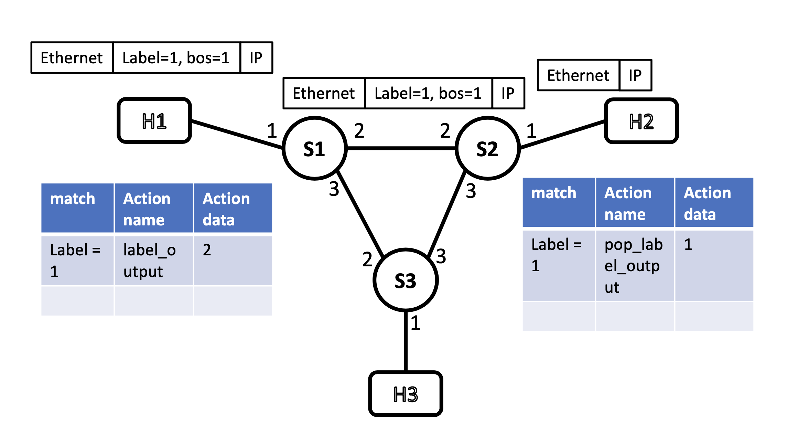
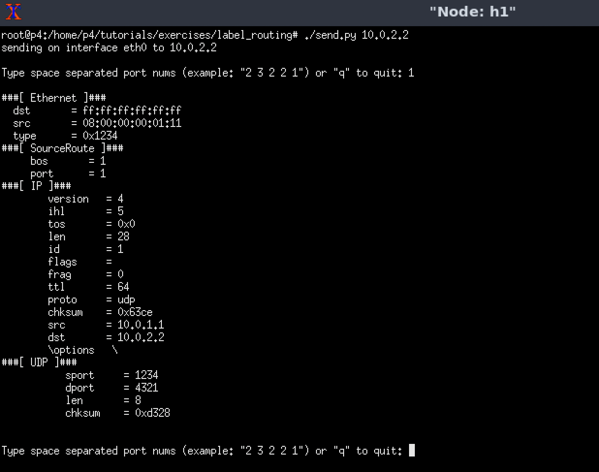

# P4 Lab

In this lab, we modify a [tutorial](https://github.com/p4lang/tutorials/tree/master/exercises/source_routing) from the offical tutorials. The original one is to do source routing, but we modify it to use label to route the packet.

## Topology


## Source Code
```c++ title="source_routing.p4"
/* -*- P4_16 -*- */
#include <core.p4>
#include <v1model.p4>

const bit<16> TYPE_IPV4 = 0x800;
const bit<16> TYPE_SRCROUTING = 0x1234;

#define MAX_HOPS 9

/*************************************************************************
*********************** H E A D E R S  ***********************************
*************************************************************************/

typedef bit<9>  egressSpec_t;
typedef bit<48> macAddr_t;
typedef bit<32> ip4Addr_t;

header ethernet_t {
    macAddr_t dstAddr;
    macAddr_t srcAddr;
    bit<16>   etherType;
}

header srcRoute_t {
    bit<1>    bos;
    bit<15>   port;
}

header ipv4_t {
    bit<4>    version;
    bit<4>    ihl;
    bit<8>    diffserv;
    bit<16>   totalLen;
    bit<16>   identification;
    bit<3>    flags;
    bit<13>   fragOffset;
    bit<8>    ttl;
    bit<8>    protocol;
    bit<16>   hdrChecksum;
    ip4Addr_t srcAddr;
    ip4Addr_t dstAddr;
}

struct metadata {
    /* empty */
}

struct headers {
    ethernet_t              ethernet;
    srcRoute_t[MAX_HOPS]    srcRoutes;
    ipv4_t                  ipv4;
}

/*************************************************************************
*********************** P A R S E R  ***********************************
*************************************************************************/

parser MyParser(packet_in packet,
                out headers hdr,
                inout metadata meta,
                inout standard_metadata_t standard_metadata) {
    
    state start {
        transition parse_ethernet;
    }

    state parse_ethernet {
        packet.extract(hdr.ethernet);
        transition select(hdr.ethernet.etherType) {
            TYPE_SRCROUTING: parse_srcRouting;
            default: accept;
        }
    }

    state parse_srcRouting {
        packet.extract(hdr.srcRoutes.next);
        transition select(hdr.srcRoutes.last.bos) {
            1: parse_ipv4;
            default: parse_srcRouting;
        }
    }

    state parse_ipv4 {
        packet.extract(hdr.ipv4);
        transition accept;
    }

}


/*************************************************************************
************   C H E C K S U M    V E R I F I C A T I O N   *************
*************************************************************************/

control MyVerifyChecksum(inout headers hdr, inout metadata meta) {   
    apply {  }
}


/*************************************************************************
**************  I N G R E S S   P R O C E S S I N G   *******************
*************************************************************************/

control MyIngress(inout headers hdr,
                  inout metadata meta,
                  inout standard_metadata_t standard_metadata) {

    action drop() {
        mark_to_drop(standard_metadata);
    }
    
    action update_ttl(){
        hdr.ipv4.ttl = hdr.ipv4.ttl - 1;
    }

    action label_output(egressSpec_t port) {
        standard_metadata.egress_spec = port;
    }

    action pop_label_output(egressSpec_t port) {
        hdr.ethernet.etherType = TYPE_IPV4;
        standard_metadata.egress_spec = port;
        hdr.srcRoutes.pop_front(1);
    }

    table label_exact {
        key = {
            hdr.srcRoutes[0].port: exact;
        }
        actions = {
            label_output;
            pop_label_output;
            drop;
            NoAction;
        }
        size = 1024;
        default_action = drop();
    }

    
    apply {
        if (hdr.srcRoutes[0].isValid()){
            if (hdr.ipv4.isValid()){
                update_ttl();
            }
            if (hdr.srcRoutes[0].bos == 1){
                label_exact.apply();
            }
        } else{
            drop();
        } 
    }
}

/*************************************************************************
****************  E G R E S S   P R O C E S S I N G   *******************
*************************************************************************/

control MyEgress(inout headers hdr,
                 inout metadata meta,
                 inout standard_metadata_t standard_metadata) {
    apply {  }
}

/*************************************************************************
*************   C H E C K S U M    C O M P U T A T I O N   **************
*************************************************************************/

control MyComputeChecksum(inout headers  hdr, inout metadata meta) {
    apply {
        update_checksum(
            hdr.ipv4.isValid(),
            { hdr.ipv4.version,
              hdr.ipv4.ihl,
              hdr.ipv4.diffserv,
              hdr.ipv4.totalLen,
              hdr.ipv4.identification,
              hdr.ipv4.flags,
              hdr.ipv4.fragOffset,
              hdr.ipv4.ttl,
              hdr.ipv4.protocol,
              hdr.ipv4.srcAddr,
              hdr.ipv4.dstAddr },
            hdr.ipv4.hdrChecksum,
            HashAlgorithm.csum16);
    }
}

/*************************************************************************
***********************  D E P A R S E R  *******************************
*************************************************************************/

control MyDeparser(packet_out packet, in headers hdr) {
    apply {
        packet.emit(hdr.ethernet);
        packet.emit(hdr.srcRoutes);
        packet.emit(hdr.ipv4);
    }
}

/*************************************************************************
***********************  S W I T C H  *******************************
*************************************************************************/

V1Switch(
MyParser(),
MyVerifyChecksum(),
MyIngress(),
MyEgress(),
MyComputeChecksum(),
MyDeparser()
) main;
```

## Entries Injection
```json title="s1-runtime.json"
{
  "target": "bmv2",
  "p4info": "build/source_routing.p4.p4info.txt",
  "bmv2_json": "build/source_routing.json",
  "table_entries": [
    {
      "table": "MyIngress.label_exact",
      "default_action": true,
      "action_name": "MyIngress.drop",
      "action_params": { }
    },
    {
      "table": "MyIngress.label_exact",
      "match": {
        "hdr.srcRoutes[0].port": 1
      },
      "action_name": "MyIngress.label_output",
      "action_params": {
        "port": 2
      }
    }
  ]
}
```
```json title="s2-runtime.json"
{
  "target": "bmv2",
  "p4info": "build/source_routing.p4.p4info.txt",
  "bmv2_json": "build/source_routing.json",
  "table_entries": [
    {
      "table": "MyIngress.label_exact",
      "default_action": true,
      "action_name": "MyIngress.drop",
      "action_params": { }
    },
    {
      "table": "MyIngress.label_exact",
      "match": {
        "hdr.srcRoutes[0].port": 1
      },
      "action_name": "MyIngress.pop_label_output",
      "action_params": {
        "port": 1
      }
    }
  ]
}
```

## Prerequisite
1. Follow the [README](https://github.com/p4lang/tutorials) to install the virtual machine. If you are not familiar with vagrant, it just a virtual machine organizer, you can think of it like Docker. (You have to install it before you start the lab.)
```bash
$ cd vm-ubuntu-20.04
$ vagrant up
```
2. Wait for about an hour to complete the installation.
3. Follow the instructions in this [link](https://github.com/p4lang/tutorials/tree/master/vm-ubuntu-20.04). It will tell you some optional steps to follow up.
4. After complete all these step, you can start to compile the code.

## Steps
You can directly modify the code under the `tutorials/exercises/source_routing` or you can copy it before modifying. All instructions below follow this [instruction](https://github.com/p4lang/tutorials/tree/master/exercises/source_routing).

1. After you replace all aforemehtioned files, type make to compile the p4 code and set up mininet nodes.
```bash
p4@p4$ make
```
2. Open terminal for two hosts.
```bash
mininet> xterm h1 h2
```
3. h2 is the receiver.
```bash
h2> ./receive.py
```
4. h1 is the sender. (10.0.2.2 is the ip of h2, under `topology.json`)
```bash
h1> ./send.py 10.0.2.2
```
5. You can then inspect the result.
6. Delete all resources.
```bash
# Exit mininet
mininet> exit

# Clean mininet resources
p4@p4$ make stop
p4@p4$ make clean
```

## Result
table entries


h1:


h2:


## References
- https://github.com/p4lang/tutorials/tree/master/exercises/basic
- https://github.com/p4lang/tutorials/tree/master/exercises/source_routing