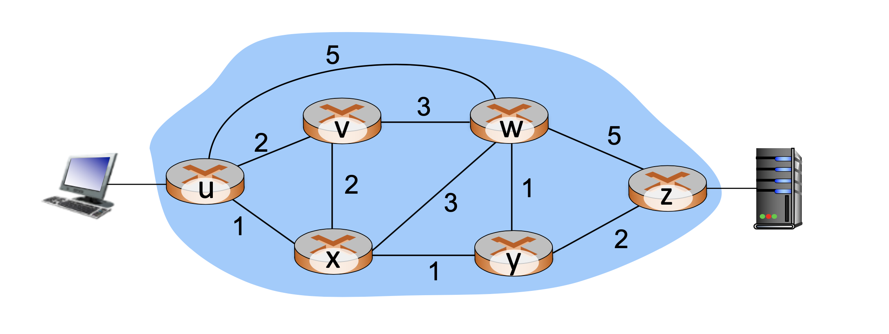

# Network Review

## Types of Network

### ISP Networks
- Entity only owns the switches
- Throughput: 100GB-10TB
- Heterogeneous devices: laptop/desktop
- Medium latency: 20-80 milliseconds

### Enterprise Networks
- Including campus network
- One entity owns many of the servers + switches
- Throughput: 10G-40GB
- Heterogeneous devices: laptop/desktop
- Medium latency: 5-10 milliseconds

### Clouds/Data Centers
- One entity owns servers + switches
- Homogenous devices
- Extra low latency between 2 devices (20 microseconds)
- Network topology is more redundant than ISP networks for higher reliability
- Distriubted across many places

## Network Components

### Core Network
- Like ISP, CDN, ...
- Connects other switches and routers
- Lots of traffic (TB)
- Very expensive
- See a lot of flows
- Implications
    - Can’t do per flow processing
    - Can’t store per flow state
- Requirements
    - High performance over accuracy
    - Use QoS to limit your bandwidth but the underlying network can support more traffic

### Edge Network
- Connects hosts
- Sees little traffic (GB)
- Sees a small number of flows
- Implications
    - Can do per flow processing
    - Can store per for state

## Routing Overview

### Routers
- Slow Path = control plane
    - Has general purpose CPU
    - Runs routing algorithms
    - Only works on a few packets
    - Can’t process all packets
    - Very very slow
- Fast path = data plane
    - Specialized H/W
    - Very Expensive, takes 3-5 years to change
    - Performs processing on every packet
    - Very very fast

### Routing Algorithm
- In traditional routing, each router run its own routing algorithm then they interact with each other in control plane to compute forwarding tables in a distributed manner.
- Commonly, they exchange data, like network conditions, neighbors, ... , based on [OSPF protocol](https://en.wikipedia.org/wiki/Open_Shortest_Path_First). Then a router can pick up a route with the lowest cost.
- Each router has several ports, each port connect to another router (in a transparent way) and the router will generate rules to match the (port, neighbor) mapping. When a packet comes into a router, it simply forwards the packets based on these rules.
- Recalculate the route if topology change detected

### Problems
- The OSPF protocol is just fine, but it is hard for traffic engineering. You can hardly control the flow of some packets because the rules are computed in an automatic fashion.
- For example:
    - In the figure below, we cannot control the packet to follow a path of `u-x-w-y-z` because the shortest path is `u-x-y-z`. 
    - However, we set up a firewall on `w`. We want each packet to flow throught the router `w` first then to `y` or to `z` directly.
- Another problem is congesting. 
    - If all packets follow the shortest path, the path is bound to being congested. The OSPF will then do action in response to that, but it's not real-time.
    - We'd like to do some load balancing across all possible path to relieve the burden of some network links or routers.
    - We might need to have a new routing algorithm.
- Forwarding mechanism is too raw:
    - We only route packet on the basis of destination address, but we may want to do some source control. too.
    - The forwarding mechanism should be generalized to many header fields to improve flexibility of routing.

### Solutions
- We turn to a centralized solution that separate control plane and data plane.
- Control plane computes forwarding rules and data plane forwards packets according to forwarding table.

## References
- This note is based on NTU course - [Network Virtualization and Security](https://nol.ntu.edu.tw/nol/coursesearch/print_table.php?course_id=942%20U0710&class=&dpt_code=9420&ser_no=50698&semester=110-1&lang=CH)
- https://en.wikipedia.org/wiki/Open_Shortest_Path_First