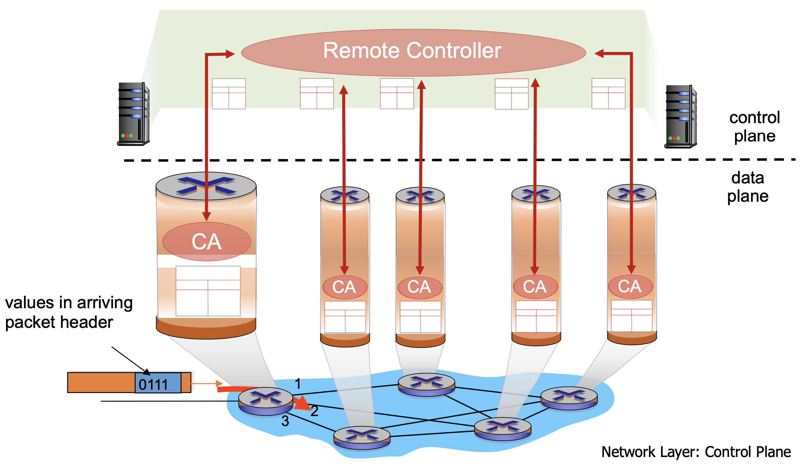

# Dimensions of SDN Applications

- TCAM = Ternary Content-addressable memory
- **CAM**: 2 states match (0, 1)
- **RCAM**: 3 states match (0, 1, X (don't care))

## Rules Installation

- OpenFlow switch use **CAM** or **TCAM** to store table entries, which has limited capacity, usually thousands of entries.
- Choose different rules in terms of traffic patters. You can also use hybrid mode, and adjust the proportion according to network conditions.

### Proactive Rules
- Controller pre-installs flow table entries --> Zero flow setup time
- Requires installation of rules for all possible traffic patterns
    - Requires use of aggregate rules (Wildcards *)
    - Require foreknowledge of traffic patterns
    - Waste flow table entries

### Reactive Rules
- First packet of each flow triggers rule insertion by the controller 
    - Each flow incurs flow setup time (Only 1 RTT per flow)
    - Controller is bottleneck (because you may have only 1 instance of controller)
    - Efficient use of flow tables

## Granularity of Rules

### Microflow
- Also called exact match rules
- One flow table matches one flow
- Uses CAM/hash-table --> 10-20K per physical switch
- Allows precisions
    - Monitoring: gives counters for individual flows
    - Access-Control: allow/deny individual flows
    - Ex: IP, port, ...

### WildCards 
- Also called aggregated rules
- One flow table entry matches a group of flow
- Uses TCAM --> 5000~4K per physical switch
- Allows scale
    - Minimizes overhead by grouping flows

## Architecture

- **Eastbound API** or **Westbound API**: communicate between distributed controllers

### Distributed
- Availability
    - How many controllers?
    - How do you assign switches to controllers?
    - More importantly: which assignment reduces processing time
    - How to ensure consistency between controllers
- Reliability/Fault Tolerance
    - (Traditional) Existing network survives failures or bugs in code for any one devices
    - (SDN) Controller: Single point of control. Bug in controller takes the whole network down
- Security
    - (Traditional) If one device in the current networks are compromised the network may still be safe
    - (SDN) Controller: Single point of control. Denial of Service attack the control channel

### Centralized
- A distinct (typically remote) controller interacts with local control agents (CAs)

## Security

### Data Plane Limitations
- Limited Number of TCAM entries
    - Currently only 1K (networks have more than 1K flow)
    - How to fit network in limited entries?
- Limited control channel capacity
    - All switches use same controller interface
    - Need to rate-limit control messages
    - Prioritize certain messages
    - Limited bandwidth, the controller may be congested and control messages can be dropped
- Limited switch CPU
    - Less power than a smartphone
    - Limit control messages and actions that use CPU
    - Switchs use CPU like send control messages or perform actions

### Debugging SDN
- Buggy App, Network OS, Switch, Hardware, ...
- In tradition, the router is made by a single manufacturer, and mostly well-tested. However, in SDN, components are produced by several vendors, which may lead to  some bugs that have not been found
- Some engineer may produce a bug that cause the entire network to crash, which results from the complexity of SDN

### Attacks
- Man in the Middle
    - Adversaries can pollute the network topology by sending fake messages about the neighbors or even impersonate a switch to forge a fake topology. (Because you can easily modify a field using raw socket)
    - And it can do other things like get more information by adding some non-existing host.
- Redirection
    - The adversary can make some traffic redirect to its own machine, and get some information, like web request (fishing website)
    - You even do not need to access control plane and you are likely to launch attacks

## References
- This note is based on NTU course - [Network Virtualization and Security](https://nol.ntu.edu.tw/nol/coursesearch/print_table.php?course_id=942%20U0710&class=&dpt_code=9420&ser_no=50698&semester=110-1&lang=CH)