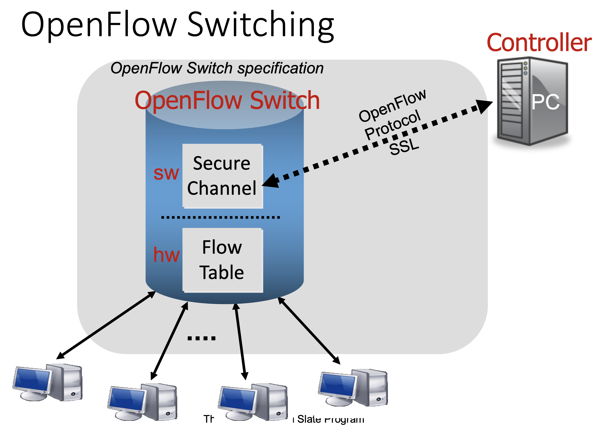
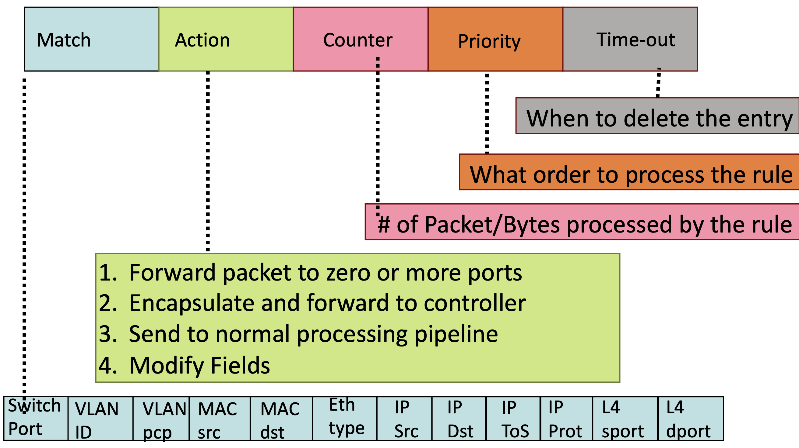
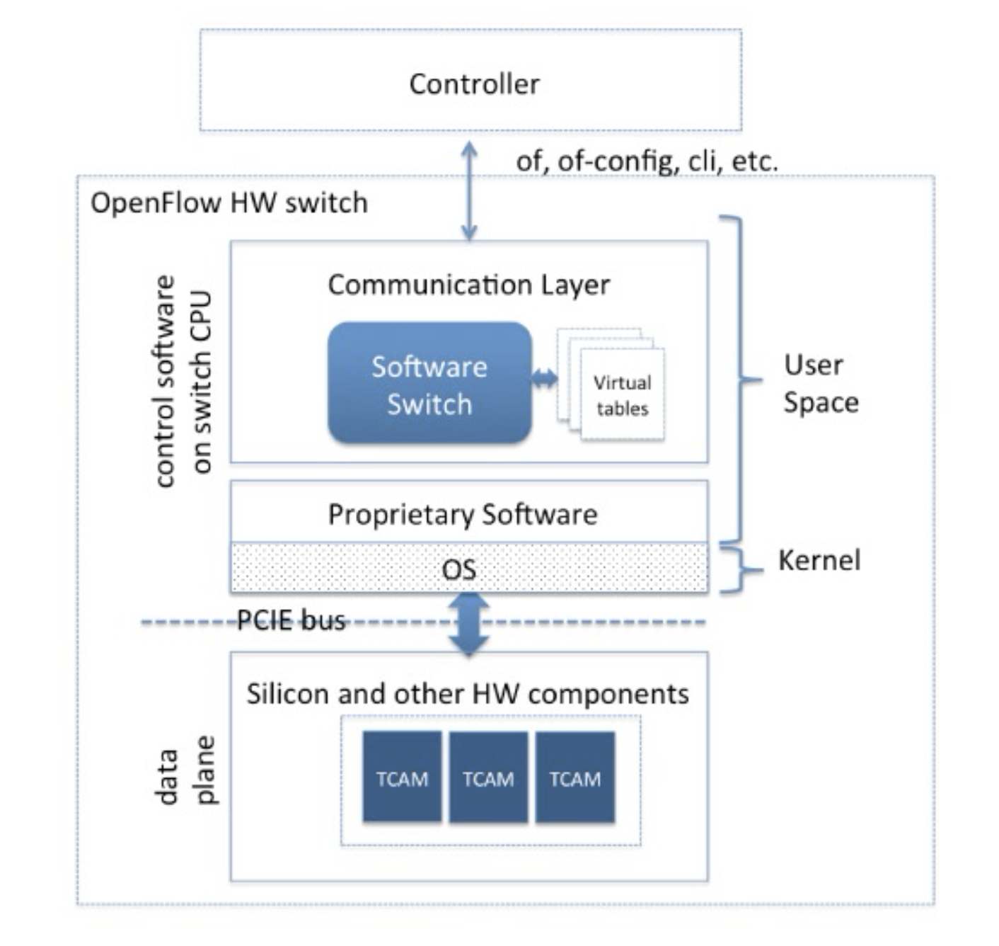

# OpenFlow

## History
- Developed in Stanford, standardized by Open Networking Foundation (ONF)
- Current Version 1.5, but version implemented by switch vendors: 1.3

## Switching
- An OpenFlow switch has two layers: software layer and hardware layer
- You have to configure a OpenFlow switch by telling the controll's ip address (or other form of address)
- Software layer communicates with controller, sending network conditions and receiving flow table data
- Hardware layer is in charge of routing based on the flow table



## Data Plane Abstraction
- Flow: defined by header fields
- Generalized forwarding: simple packet-handling rules
    - **Pattern**: match values in packet header fields
    - **Actions**: for matched packet: `drop`, `forward`, `modify`, `matched packet` or `send matched packet` to controller
    - **Priority**: disambiguate overlapping patterns
    - **Counters**: #bytes and #packets
- Rule examples:
```
1. src=1.2.*.*, dest=3.4.5.* -> drop
2. src = *.*.*.*, dest=3.4.*.* -> forward(2)
3. src=10.1.2.3, dest=*.*.*.* -> send to controller
```

### Header


### Forward Examples


## Types of Messages

### Asynchronous
- Controller-to-Switch:
    - **Send-packet**: to send packet out of a specific port on a switch
    - **Flow-mod**: to add/delete/modify flows in the flow table
- Initiated by the controller (two-way communication):
    - **Read-state**: to collect statistics about flow table, ports and individual flows
    - **Features**: sent by controller when a switch connects to find out the features supported by a switch
    - **Configuration**: to set and query configuration parameters in the switch
- Initiated by the switch:
    - **Packet-in**: for all packets that do not have a matching rule, this event is sent to controller
    - **Flow-removed**: whenever a flow rule expires, the controller is sent a flow-removed message
    - **Port-status**: whenever a port configuration or state changes, a message is sent to controller
    - **Error**: error messages

### Symmetric
- Can be sent in either direction without solicitation
- **Hello**: at connection startup
- **Echo**: to indicate latency, bandwidth or liveliness of a controller-switch connection
- **Vendor**: for extensions (that can be included in later OpenFlow versions)

## Message Formats
- Controller encapsulates message into an object
    - Accessor functions to different fields
    - No need to worry about crafting network packets 


## Actions

### Output to switch port
- Physical ports & virtual ports
- `ALL` (all standard ports excluding the ingress port) --> `Flooding`
- `CONTROLLER` (encapsulate and send the packet to controller) –-> `PACKET_IN`
- `LOCAL` (switch’s stack) 
    - Go through the IP layer, etc (mostly used for vSwitches)
    - Used for inter-switch communication
    - The normal packets are directly processed by hardward, no messages needed
- `NORMAL` (process the packet using traditional non-OpenFlow pipeline of the switch) –-> traditional L2 forwarding, L3 routing
- There are still some types of messages that can send to a single port

### Set fields
- Packet modification/header rewriting (every field that OpenFlow supports)
    - Ethernet Source address
    - Ethernet Dest address
    - IP source & dest addresses, IP ToS, IP ECN, IP TTL, VLAN
    - TCP/UDP source and destination ports
    - ...
- Therefore, it hards to determine if a packet's fields are changed
- Payload has a lot of mechanism (MAC, certificate) to ensure integrity, but header is hard (because the designer of the Internet did not consider this an issue)

### Others
- `Drop`, like firewall
- `Strip` (pop) the outer VLAN tag
- Set queue ID when outputting to a port (Enqueue) (QoS, priority queue)
- Support for matching across multiple tables
    - It can reduces the number of entries
    - Ex: All combinations of 3 ports and 4 ips
        - 3 * 4 = 12 in a single table
        - 3 + 4 = 7 in two tables
- Support for tunneling
- Support for Push/Pop mulitple VLAN/MPLS/PBB tags
- ...

## Flow Tables
- The structure of a flow table is like cache in computer systems
- Steps:
1. Hardware processes rules in a parallel way (TCAM) to find a match. (limited hardware capacity, extremly fast)
2. If not found, it use software tables (hash table) to find one. (Small Memory, fast)
3. If still not found, send a request to controller for rules (more than one table). (Large Memory, slow)

### Forwarding Delay
- "Tango: Simplifying SDN Control with Automatic Switch Property Inference, Abstraction, and Optimization", Aggelos Lazaris, Daniel Tahara, Xin Huang, Li Erran Li, Andreas Voellmy, Y. Richard Yang, and Minlan Yu, CoNEXT'14
- Fast path delay: 0.665 ms
- Slow path delay: 3.7 ms
- Control path delay: 7.5 ms



## Topology Discovery
- One switch connect to only one controller. 
- The administrator need to specify a controller's ip to connect to the controller, so controllers know all its switch

### LLDP
- An OpenFlow controller discover topology by sending LLDP control messages
- The controller discover the neighbor of a switch based on where packet-in comes from
- Steps:
1. To know SW1's neighbor, the controller send an LLDP `PACKET_OUT` message
2. On receiving the message, SW1 broadcasts the message to all its neighbor
3. When SW2 and SW3 receive the message, they send `PACKET_IN` message to its controller
- Question: What if SW2 or SW3 connect to a different controller
- Answer: People who use SDN mostly in their own domain, that is, under the same authority, although it may not connect to the same controller (because of distributed controllers), the controllers are likely under the same authority so the logically centralized controller will know the topology.


### Host Tracking
- It just likes how the traditional Ethernet LAN works
- Once a host sends a packet, we know this host is under which switch
- It a host never sends a packet, it doesn't matter because it does not affect the topology


## References
- This note is based on NTU course - [Network Virtualization and Security](https://nol.ntu.edu.tw/nol/coursesearch/print_table.php?course_id=942%20U0710&class=&dpt_code=9420&ser_no=50698&semester=110-1&lang=CH)