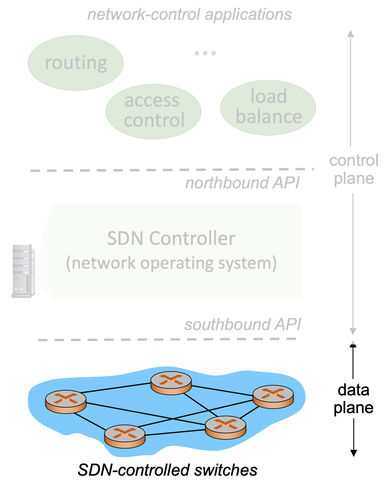
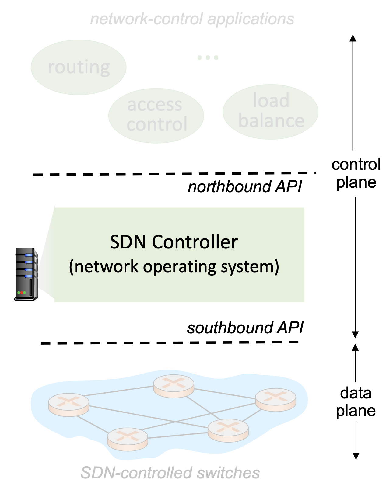
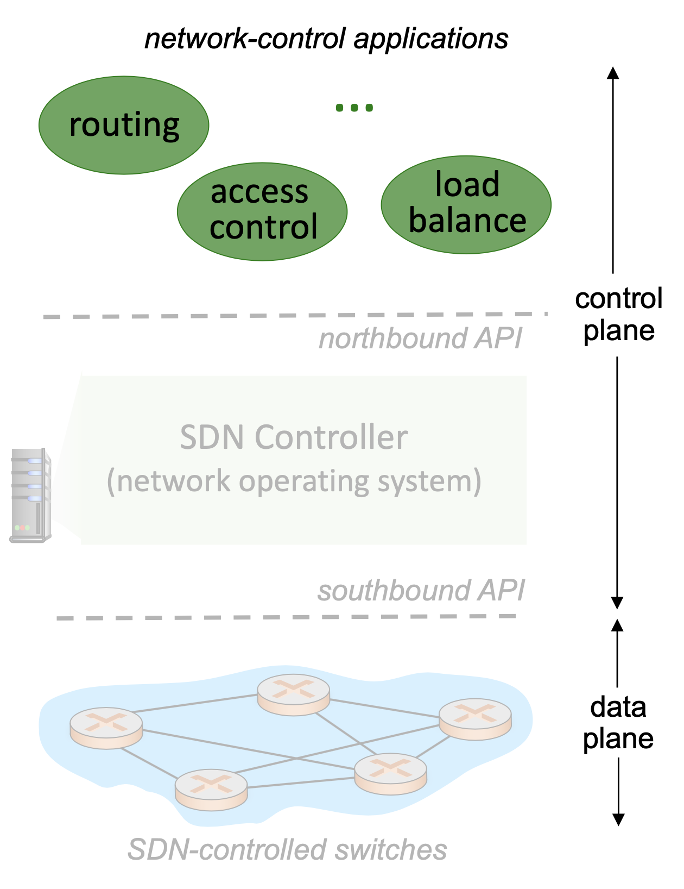
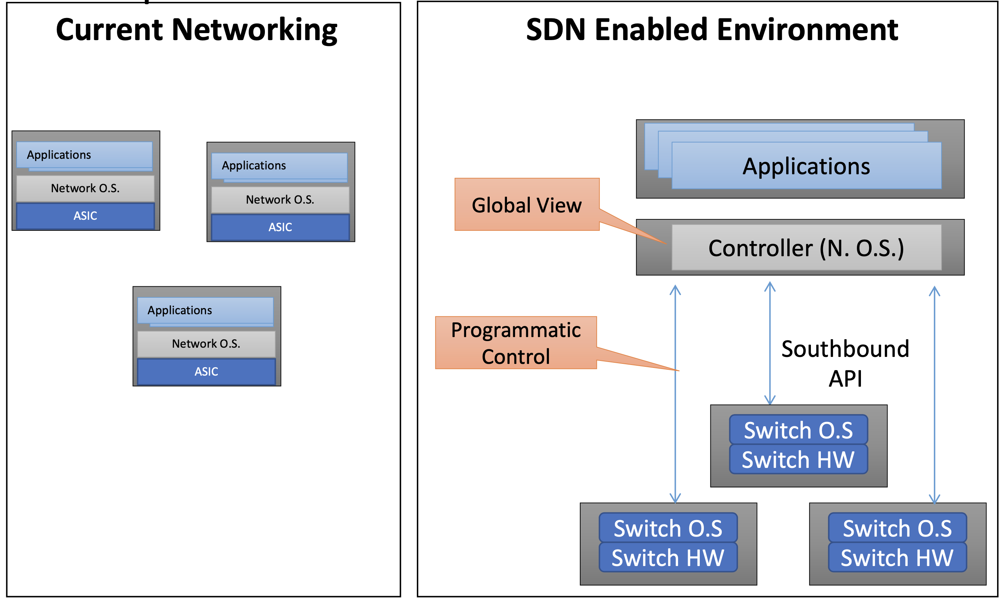

# SDN Perspectives

## Data Plan Switches
- Fast, simple, commodity switches implementing generalized data-plane forwarding in hardware
- API for table-based switch control (e.g. OpenFlow), defining what is controllable and what is not
- Protocol for communicating with controller

## SDN Controller
- Also called: network OS
- Maintain network state information
- Interact with network control applications "above" via northbound API
- Interact with network switches "below" via southbound API
- Implemented as distributed system for performance, scalability, fault-tolerance, robustness

## Control Applications
- "Brains" of control: implement control functions using lower-level services, API provided by SND controller
- Unbundled: can be provided by 3rd party: distinct from routing vendor, or SDN controller

## Implications of SDN
- Southbound API: decouples the switch hardware from control function (data plane from control plane)
- Switch Operating System: exposes switch hardware primitives

### Current Networking
- Distributed protocols
    - Each switch has a brain
    - Hard to achieve optimal solution
- Network configured indirectly
    - Configure protocols
    - Hope protocols converge

### SDN Enabled Environment
- Global view of the network
    - Applications can achieve optimal
    - More real-time
- Southbound API gives fine grained control over switch
    - Network configured directly
    - Allows automation
    - Allows definition of new interfaces

## The SDN Stack

## SDN Network

## References
- This note is based on NTU course - [Network Virtualization and Security](https://nol.ntu.edu.tw/nol/coursesearch/print_table.php?course_id=942%20U0710&class=&dpt_code=9420&ser_no=50698&semester=110-1&lang=CH)